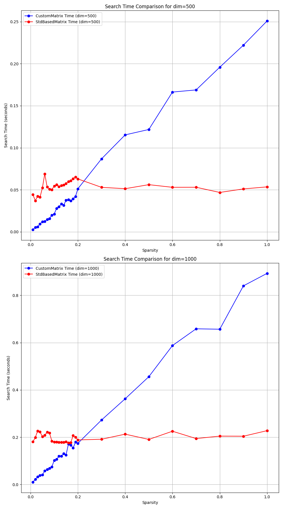

# Лабораторная работа №4
**Дисциплина:** Программирование на С++.  
**Тема:** Шаблоны. Разработка собственного класса для разреженных матриц и векторов на C++.  
**Выполнил:** Попов П.С.  
**Группа:** P4116  
**Преподаватель:** Лаздин А.В.  
**Дата:** 16.12.2024

## Введение
В том случае, когда подавляюще большое количество элементов вектора или матрицы равны нулям для их хранения имеет смысл использовать структуры данных, позволяющие существенно экономить память, за счёт того, что нули можно не хранить.

## Цель работы
Разработать шаблонные классы для хранения разреженных вектора и 2D матрицы для чего:

- Предложить структуры данных для хранения значений исходных векторов и матриц. (подсказка: использование хеш-таблиц — хорошая идея), рассмотрите необходимость поддержки собственных итераторов;

- Реализовать набор унарных и бинарных операций для вектора и матриц; (транспонирование, сложение, произведение векторов (вспоминаем линейную алгебру), обращение матрицы, возведение матрицы в степень — предусмотреть два варианта с целочисленным и вещественным показателем, подумать на тему относительно того, как решить вопрос с возведением в степень — т.  е. в степень можно возводить только квадратные матрицы, но не создавать же отдельный класс для квадратных и для прямоугольных матриц, или создавать?), произведение вектора и матрицы.
Реализовать поэлементные операции для элементов векторов и матриц — арифметические операции со скалярной величиной, поэлементное возведение в степень.

- Провести сравнение скоростей обработки предложенного вами способа хранения и обработки разреженных матриц и выполнение тех же действий над векторами и матрицами, хранящимся с помощью стандартного контейнера vector.

- Результаты работы оформить в виде отчета или файла readme если код будет на Git.

## Структура программы
- `Matrix.h` - заголовок с шаблонным классом для матрицы.
- `Vector.h` - заголовок с шаблонным классом для вектора.
- `MatrixOperationsTest.cpp` - исходный код операций google-тестов для матрицы.
- `VectorOperationsTest.cpp` - исходный код операций google-тестов для вектора.
- `main.cpp` - анализ скорости работы двух вариантов реализаций матрицы.

## Исходный код 
Доступен по ссылке `https://github.com/popov-p/itmo-cxx-2024`, папка Lab-4.

## Описание решения
- Были реализованы по заданию для матриц и векторов все требуемые варианты операций: инверсия, транспонирование, возведение в степень (в т.ч. нецелочисленную), поэлементные операции `+-*^/` и т.д.
- Шаблонный класс матрицы реализован на основании хэш-таблицы для поиска, а также `std::map` для поддержки итераторов.

- Полный листинг в отчёте займёт много места.
Поэтому рассмотрим самые интересные подпункты задания,
а именно: поддержка итераторов, реализация возведения в нецелочисленную степень (заметим, что возведение в целочисленную степень также реализовано, но оно заметно проще) и анализ производительности.

### Поддержка собственных итераторов
- Были реализованы методы `begin()`, `end()`, `cbegin()`, `cend()` созвращающие итератор 
и константный итератор на конец и начало списка соответственно.

- Заметим, что если итерироваться по хэш-таблице при помощи её итераторов, то упорядоченность элементов не гарантируется.
Поэтому необходимо дополнительно хранить `std::map` (упорядоченный контейнер, содержащий наши элементы), чтобы итерироваться в строчно-столбцовом порядке.

### Математическое обоснование возведения в степень
Возвести в степень можно только квадратную матрицу.  
Возведение матрицы $A$ в степень $p$ реализуется по формуле:
$$
A^p = \exp(p \cdot \log(A)).
$$
Для реализации требуемого функционала дополним решение вспомогательными функциями вычисления логарифма и экспоненты матрицы:
$$
\log(A) = (A - I) - \frac{(A - I)^2}{2} + \frac{(A - I)^3}{3} - \dots
$$
разложение логагифма в ряд Тейлора.  
Естественно заметить, что такой ряд сойдется не для всех $A$, а  только для тех, у кого все собственные значения матрицы $|\lambda_i| < 1, \quad \forall i = 1, \ldots, n$.  
Все собственные значения $|\lambda_i| < 1, \quad \forall i = 1, \ldots, n$ (лежат внутри единичного круга) тогда и только тогда, когда $\|A_F\| < 1$ (норма Фробениуса).

$$ \| A \|_F =\sqrt{\sum_{i=1}^{n} |\lambda_i|^2} = \sqrt{\sum_{i=1}^{m} \sum_{j=1}^{n} |a_{ij}|^2}< 1 $$

Вспомогательное разложение для экспоненты выглядит так: 
$$
\exp(A) = I + A + \frac{A^2}{2!} + \frac{A^3}{3!} + \dots
$$
- разложение экспоненты в ряд Тейлора.

Более общий случай при $||A|| > 1$ требует реализации более сложных алгоритмов "скейлирования", поэтому будем считать, что реализованные мною функции принимают на вход матрицы ||A|| < 1.

## Сравнение скоростей работы матриц
По заданию необходимо сравнить нашу реализацию на хэш-таблице с реализацией матрицы на `std::vector<std::vector<double>>`.  
Выполним тестирование следующим образом:

- Инициализируем `stdBasedMatrix` матрицу случайными значениями в диапазоне [0, 100] с разным параметром `sparsity`, об этом далее.

- Сохраним ненулевые значения в `customMatrix`, основанную на хэш-таблице, а также сформируем массив для поиска `nonZeroElements`
(т.е. сохраним из матриц все ненулевые элементы). Заметим, что набор ненулевых элементов одинаков в обеих матрицах (для корректности исследования).

- Просуммируем время поиска по `customMatrix` и по `stdBasedMatrix` элементов из `nonZeroElements` соответственно.
Этот подход и будет нашим тестом скорости.

- Реализуем подход для двух разных размерностей `dim = 500, 1000`.
- sparsity - количество ненулевых значений в матрице (в долях).  
- Сетку построим в интервале [0.01, 0.2] c шагом 0.01, а далее на интервале [0.2, 1] с шагом 0.1.

### Комментарий к графику
Из графика (стр. 5) видно, что:

- Хэш-таблицу для матрицы имеет смысл использовать, если количество ненулевых элементов не превышает примерно 20%.

- Если количество ненулевых элементов превышает 20%, то хэш-таблица становится хуже реализации на `std::vector<std::vector<double>>`.

- Протестированы различные варианты хэш-функций для ключей в хэш-таблице, получен аналогичный результат.

- Такую "просадку" по производительности для хэш-таблицы неразреженной матрицы `sparsity` > 20% можно объяснить затратами на вычисление хэш-функции и большим количеством коллизий, ведь, как известно, хэш-таблица не вполне предусмотрена для хранения большого количества элементов.
